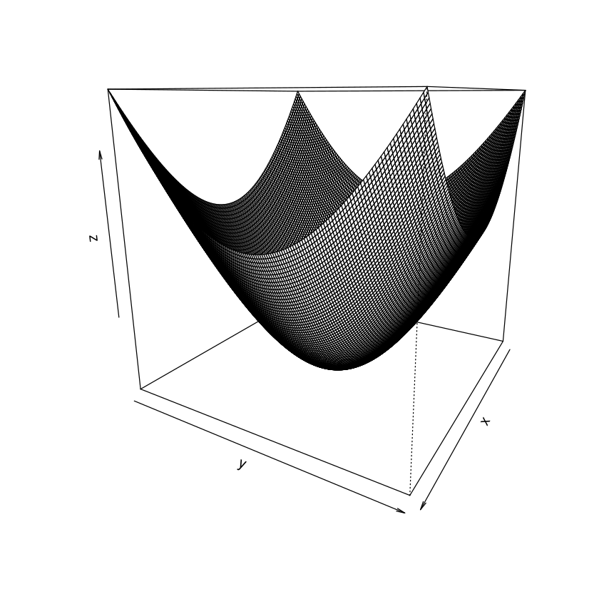

# R introduction.

R is a object programming language and therefore is very handy, to handle datasets.
R have a vector style, that is at least efficient to numerical computations.

there are different type of objects one of them is the numeric vector.
to define a numerical vector we must type:

### Numeric vector

x = c(1,2,4,10)

or we can also type

x <- c(1,2,4,10)

x <- c(1,2,4,10)

we must note that this vector contain only componentes of the same mode.

another object that we must define  is the list, whose components 
could be the other types.

### character vector

y = c('figure A', 'figure B', 'figure C')

note that to print the previous line, the components were printred with double quotes.
However, they can be define with only one or double quotes.

### Logical vectors

in *R* the boolean values are written as FALSE and TRUE, this remark an important fact
that *R* is casesentivie, this means that
x = 1
X = 10
are different variables.

c(FALSE, FALSE, TRUE)

## NaN and NA.

The missing values are important when we are working with real datasets. 
the following vector:
g=c(10,40,NA)

the function **is.nan()** will return a logical vector defining, indicating with elements
met the criteria.

missing=is.nan(g)

f=c(10,40,NaN)

note that difference, the NA value was not encounter by the function

is.na(f)

if can encounter the two values that are indicate as Missing values.

### subset or indexing.
we uses square brackets [] to limit a subset of elements. 
we have the following vector:

v1 = c(1,2,3,4,6)

that we can also create with __start:end__

v1_ = 1:10

now we can indexing from the fourt until the last.

v1_subset = v1[4:length(v1)]

note that **length()** return the number of elements that composes the vector __v1__

also, there are important functions as min(), max(), mean(),  and others that are
apply to the vectors.

it is important note the uses of explicit uses of () side to function names, due
onward, we'll se the uses of pipelines with the packages mgtri.

for instance calculate we can calculate the mean in the following sense,
we have


### list 

list is a general type, that can contain numerical, character and logical values.


```R
# Create a DataFrame in R.
name = c('First', 'Second', 'Third','n-place')
let = c('One', 'two', 'three','n')
data = data.frame(name, let)
class(data)
#datatable(data, options=list())
#detach to unload packages
```


'data.frame'


```R
#Get directory
getwd()
#List directoris in the folder.
list.files()
#Loading the dataset
read.csv('data.csv')   #Note that the table indicates the type of variables.
```


'/home/ces/courses/linear_Models/linear_models'


<style>
.list-inline {list-style: none; margin:0; padding: 0}
.list-inline>li {display: inline-block}
.list-inline>li:not(:last-child)::after {content: "\00b7"; padding: 0 .5ex}
</style>
<ol class=list-inline><li>'data_xls.xls'</li><li>'data.csv'</li><li>'README.md'</li><li>'Untitled.ipynb'</li></ol>


<table>
<caption>A data.frame: 4 x 3</caption>
<thead>
	<tr><th scope=col>var1</th><th scope=col>var2</th><th scope=col>var3</th></tr>
	<tr><th scope=col>&lt;int&gt;</th><th scope=col>&lt;chr&gt;</th><th scope=col>&lt;chr&gt;</th></tr>
</thead>
<tbody>
	<tr><td>0</td><td>file </td><td> </td></tr>
	<tr><td>1</td><td>file1</td><td>a</td></tr>
	<tr><td>2</td><td>file2</td><td>b</td></tr>
	<tr><td>3</td><td>file </td><td> </td></tr>
</tbody>
</table>


## CART models
CAST stands for _classification and regression tree_
```
      (Root)
         |
         |
        / \
      /    \
  (Node c)  (Node $\alpha$)
                  /  \
                 /    \ 
             leave    leave
```

This approach is based in algorithms that could describe in terms of *if* and *else*


 ## put working directory
 to known the work directory we can uses **getwd()** and for set we can uses **setwd(_path_)**.
 in Unix-like Sysems the path of a work could be get with
 ```bash 
 pwd
 ```
 in Windos OS usually the _path_ start with _C:/User/_
 
## Load data from URL
recipes=
## loading a dataset
**read.csv(dataset.csv)**  this function also support another parameters as header, 
remember that here the boolean values are written in uppercase, for instance FALSE. 
### Complementary tools
**head(dataset)** to see the firts rows.

### Loading from a repo.
sometimes is important share datasets or used avaliable datasets.


```R
#install.packages('RCurl')   install the packages only once.
library(RCurl)
url = 'https://raw.githubusercontent.com/it-ces/linear_models/main/data.csv'
read.csv(url)
```


<table>
<caption>A data.frame: 4 x 3</caption>
<thead>
	<tr><th scope=col>var1</th><th scope=col>var2</th><th scope=col>var3</th></tr>
	<tr><th scope=col>&lt;int&gt;</th><th scope=col>&lt;chr&gt;</th><th scope=col>&lt;chr&gt;</th></tr>
</thead>
<tbody>
	<tr><td>0</td><td>file </td><td> </td></tr>
	<tr><td>1</td><td>file1</td><td>a</td></tr>
	<tr><td>2</td><td>file2</td><td>b</td></tr>
	<tr><td>3</td><td>file </td><td> </td></tr>
</tbody>
</table>


### Excel file

we need install *readxl* 
to open a spreed sheat from web, we need take a copy in the local machine, then we dowland in a spefict path.
```R
url = 'https://gith...'
path = '~/namefile.xls'
download.file1(url,path)
```
where _namefile.xls_ could be the name of the file that we'll download.


```R
install.packages('readxl')
library('readxl')
url = 'https://github.com/it-ces/linear_models/blob/main/data_xls.xls?raw=true'
path = '/home/ces/courses/linear_Models/data_xls.xls'
getwd()
download.file(url = url, destfile ='/home/ces/courses/linear_Models/data_xls.xls')
read_excel('/home/ces/courses/linear_Models/data_xls.xls')
```

    


'/home/ces/courses/linear_Models/linear_models'


<table>
<caption>A tibble: 4 x 2</caption>
<thead>
	<tr><th scope=col>varName1</th><th scope=col>varName2</th></tr>
	<tr><th scope=col>&lt;chr&gt;</th><th scope=col>&lt;chr&gt;</th></tr>
</thead>
<tbody>
	<tr><td>Triangle</td><td>proof  </td></tr>
	<tr><td>Circle  </td><td>theorem</td></tr>
	<tr><td>square  </td><td>theorem</td></tr>
	<tr><td>square  </td><td>theorem</td></tr>
</tbody>
</table>


# Basic Statistics in R
#### qwraps2


```R
# to see what packages are loaded in memory actually.
(.packages())
a = (.packages())
typeof(a)
class(a)
packageVersion("stats")
packageVersion("graphics")
packageVersion("grDevices")
packageVersion("datasets")
packageVersion("utils")
packageVersion("methods")
packageVersion("base")

```


<style>
.list-inline {list-style: none; margin:0; padding: 0}
.list-inline>li {display: inline-block}
.list-inline>li:not(:last-child)::after {content: "\00b7"; padding: 0 .5ex}
</style>
<ol class=list-inline><li>'stats'</li><li>'graphics'</li><li>'grDevices'</li><li>'datasets'</li><li>'utils'</li><li>'methods'</li><li>'base'</li></ol>


    [1] ‘4.0.2’


'character'


'character'


    [1] ‘4.0.2’


    [1] ‘4.0.2’


    [1] ‘4.0.2’


    [1] ‘4.0.2’


    [1] ‘4.0.2’


    [1] ‘4.0.2’


    [1] ‘4.0.2’

# __comparing groups__
THe following dataset contain wage in three groups, the objective will be indentify if there are or not differences among the groups.


url = 'https://raw.githubusercontent.com/it-ces/linear_models/main/wage_data.csv'
df=read.csv(url)


### compareGroups.
install.packages('compareGroups')
library('compareGroups')


this package have some extension that you can see in this [article]()
however we will explain here the most basics.
the P-value to indentify if there are differecnes among to independet groups.

#### for continuos variables
1. Normal variables
* __t__ test for two groups
* Anova for more than two groups.

1. No normal variables
*Kruskalwallis test

##### for categorical variables 

1. Chi-square or test fisher exact

## R standard formula

function_Z(dependent ~ indepent_1 + indepent_2 + indepent_3 +...+ indepent_n)

we can uses all variables using **.**(dot) and exclude with hyphen **-**.

## Create table

table =  compareGroups(Group ~ ., data =df)

#### for continuos variables
1. Normal variables
* __t__ test for two groups
* Anova for more than two groups.

1. No normal variables
*Kruskalwallis test

##### for categorical variables 

1. Chi-square or test fisher exact

## R standard formula

function_Z(dependent ~ indepent_1 + indepent_2 + indepent_3 +...+ indepent_n)

we can uses all variables using **.**(dot) and exclude with hyphen **-**.

## Create table

table =  compareGroups(Group ~ ., data =df)
ptable=createTable(table,  type = 1  )

ptable=createTable(table, digits = c(p14 = 0, hormo=1), type = 1,  )
ptable

we can export to its respective format with
* export2word
* export2pdf
* export2md
* export2tex
* export2xls

export2word(restab, file = "example.docx", header.labels = c(p.overall = "p-value"))


# Wilcoxon test 


## Data table

we must install
install.packages('data.table')
library('data.table')
df
df = as.data.table(df)

# We also index dataframes 
df[rows, columns]

df[rows_start:rows_finish, columns_start:columns_finish]

df[,] all columns , all rows

df[1:3,] the first observations or rows and all columns.

probe this all or using names.

we can draw some variables columns using [list()].

you also put logical or subset expressions,
y[var_x > #, ].

operators as == are supported also by dataframes.

var[order(var)]
y[var_x > #, ].


operators as == are supported also by dataframes.

var[order(var)]

## Working with Groups

mean for a groups

mean(Wage.dollars.[Group=='A'])

arx[, list(name_varn=mean() , maximun=max(var)) , by='var')]

by can also be used with a vector to combine more that one group.

# Excercise using UCI dataset

the following dataset was retrieved from
archive.ics.uci.edu

url = 'https://archive.ics.uci.edu/ml/machine-learning-databases/00529/diabetes_data_upload.csv'

df = read.csv(url)
View(df)
names(df)
show us the of the variables in dataset.
we can calcualte

# we can describe easily with

mean(df$Age)
table(df$Gender)
ftable(df$Gender)
table(df$Gender, exclude=NULL)

# To show proportions
gender = as.factor(df$Gender)
table(gender)

we try model
df = as.read.table(df)

library(tidyverse)
url2 = 'https://archive.ics.uci.edu/ml/machine-learning-databases/00529/diabetes_data_upload.csv'
df = read_csv(url2)
model = tree(Obesity ~ Age , data=df)
appear a warning message;

now we are using pipes

dim(df)
this a important package to clean names:

library(janitor)

for what is mutate()
Mutate it is a important function that crete other variables.
for instance,
mutate(data, varnew = exp(var1, var2... var3))
were **exp()** it is a aritmetical expression.


this a good lecture.

the **args()** function is important, due allow us to known what are the name of arguments in the function.

for instance:
args(replace)

## Functions in R
function_name = function(){

    expressions

}

thus we need uses the **function()** constructor.

to call the function we can uses function_name().

R will return the last line of code in the function. note that this different to the return option in python.

arguments of functions

function_name = function(argument){
    expressions
}

you arise a error if you call the function witouth the argument.

to avoid this we need provide a argument value by default for instance.

own_mean = function(data){
    data=1:10
    mean = sum(data) / length(data)
    print(mean)
    
    
    function_name = function(argument){
    expressions
}

there are not restrictions to the number of arguemtns only will be separeted by comma.


qplot to graph belong to the ggplot2 library
x = 1:13
y = x^3
plot(x,y)

data=1:100
hist(data)


you arise a error if you call the function witouth the argument.


## Dices normal distributed

ooll2_dice = function(){
population = 1:6
sum = sum(sample(population, size=2 , replace=TRUE))
sum
}

## replicates
 works a loops but shorthand of a loops
 as in python code.
 for x in range(#):
                function()
now, we are using
dist =  replicate(200, roll2_dice())
hist(dis)


to avoid this we need provide a argument value by default for instance.

own_mean = function(data){
    data=1:10
    mean = sum(data) / length(data)
    print(mean)


```R

```

### Excel file

we need install *readxl* 
to open a spreed sheat from web, we need take a copy in the local machine, then we dowland in a spefict path.
```R
url = 'https://gith...'
path = '~/namefile.xls'
download.file1(url,path)
```
where _namefile.xls_ could be the name of the file that we'll download.

install.packages('readxl')
library('readxl')
url = 'https://github.com/it-ces/linear_models/blob/main/data_xls.xls?raw=true'
path = '/home/ces/courses/linear_Models/data_xls.xls'
getwd()
download.file(url = url, destfile ='/home/ces/courses/linear_Models/data_xls.xls')
read_excel('/home/ces/courses/linear_Models/data_xls.xls')


```R
c = c(1,2,3,4)
volcano
cone <- function(x, y){
sqrt(100 + x^2+y^2)
}
x = y =  seq(-10, 10, length= 140)
z <- outer(x, y, cone)
persp(x,y,z, theta=120)
```


<table>
<caption>A matrix: 87 x 61 of type dbl</caption>
<tbody>
	<tr><td>100</td><td>100</td><td>101</td><td>101</td><td>101</td><td>101</td><td>101</td><td>100</td><td>100</td><td>100</td><td>...</td><td>107</td><td>107</td><td>107</td><td>106</td><td>106</td><td>105</td><td>105</td><td>104</td><td>104</td><td>103</td></tr>
	<tr><td>101</td><td>101</td><td>102</td><td>102</td><td>102</td><td>102</td><td>102</td><td>101</td><td>101</td><td>101</td><td>...</td><td>108</td><td>108</td><td>107</td><td>107</td><td>106</td><td>106</td><td>105</td><td>105</td><td>104</td><td>104</td></tr>
	<tr><td>102</td><td>102</td><td>103</td><td>103</td><td>103</td><td>103</td><td>103</td><td>102</td><td>102</td><td>102</td><td>...</td><td>109</td><td>108</td><td>108</td><td>107</td><td>107</td><td>106</td><td>106</td><td>105</td><td>105</td><td>104</td></tr>
	<tr><td>103</td><td>103</td><td>104</td><td>104</td><td>104</td><td>104</td><td>104</td><td>103</td><td>103</td><td>103</td><td>...</td><td>109</td><td>109</td><td>108</td><td>108</td><td>107</td><td>107</td><td>106</td><td>106</td><td>105</td><td>105</td></tr>
	<tr><td>104</td><td>104</td><td>105</td><td>105</td><td>105</td><td>105</td><td>105</td><td>104</td><td>104</td><td>103</td><td>...</td><td>110</td><td>109</td><td>109</td><td>108</td><td>107</td><td>107</td><td>107</td><td>106</td><td>106</td><td>105</td></tr>
	<tr><td>105</td><td>105</td><td>105</td><td>106</td><td>106</td><td>106</td><td>106</td><td>105</td><td>105</td><td>104</td><td>...</td><td>110</td><td>110</td><td>109</td><td>108</td><td>108</td><td>108</td><td>107</td><td>107</td><td>106</td><td>106</td></tr>
	<tr><td>105</td><td>106</td><td>106</td><td>107</td><td>107</td><td>107</td><td>107</td><td>106</td><td>106</td><td>105</td><td>...</td><td>110</td><td>111</td><td>110</td><td>109</td><td>109</td><td>108</td><td>108</td><td>107</td><td>107</td><td>106</td></tr>
	<tr><td>106</td><td>107</td><td>107</td><td>108</td><td>108</td><td>108</td><td>108</td><td>107</td><td>107</td><td>106</td><td>...</td><td>113</td><td>112</td><td>110</td><td>110</td><td>109</td><td>109</td><td>108</td><td>108</td><td>107</td><td>106</td></tr>
	<tr><td>107</td><td>108</td><td>108</td><td>109</td><td>109</td><td>109</td><td>109</td><td>108</td><td>108</td><td>107</td><td>...</td><td>115</td><td>114</td><td>112</td><td>110</td><td>110</td><td>109</td><td>109</td><td>108</td><td>107</td><td>107</td></tr>
	<tr><td>108</td><td>109</td><td>109</td><td>110</td><td>110</td><td>110</td><td>110</td><td>109</td><td>109</td><td>108</td><td>...</td><td>117</td><td>115</td><td>113</td><td>111</td><td>110</td><td>110</td><td>109</td><td>108</td><td>107</td><td>107</td></tr>
	<tr><td>109</td><td>110</td><td>110</td><td>111</td><td>111</td><td>111</td><td>111</td><td>110</td><td>110</td><td>110</td><td>...</td><td>118</td><td>116</td><td>114</td><td>112</td><td>111</td><td>110</td><td>109</td><td>108</td><td>107</td><td>106</td></tr>
	<tr><td>110</td><td>110</td><td>111</td><td>113</td><td>112</td><td>111</td><td>113</td><td>112</td><td>112</td><td>114</td><td>...</td><td>119</td><td>117</td><td>115</td><td>113</td><td>111</td><td>110</td><td>109</td><td>108</td><td>107</td><td>106</td></tr>
	<tr><td>110</td><td>111</td><td>113</td><td>115</td><td>114</td><td>113</td><td>114</td><td>114</td><td>115</td><td>117</td><td>...</td><td>120</td><td>118</td><td>116</td><td>114</td><td>112</td><td>110</td><td>109</td><td>108</td><td>107</td><td>105</td></tr>
	<tr><td>111</td><td>113</td><td>115</td><td>117</td><td>116</td><td>115</td><td>116</td><td>117</td><td>117</td><td>119</td><td>...</td><td>123</td><td>119</td><td>117</td><td>115</td><td>113</td><td>111</td><td>110</td><td>108</td><td>106</td><td>105</td></tr>
	<tr><td>114</td><td>115</td><td>117</td><td>117</td><td>117</td><td>118</td><td>119</td><td>119</td><td>120</td><td>121</td><td>...</td><td>126</td><td>121</td><td>117</td><td>114</td><td>112</td><td>110</td><td>110</td><td>108</td><td>106</td><td>104</td></tr>
	<tr><td>116</td><td>118</td><td>118</td><td>118</td><td>120</td><td>121</td><td>121</td><td>122</td><td>122</td><td>123</td><td>...</td><td>129</td><td>125</td><td>120</td><td>115</td><td>111</td><td>110</td><td>110</td><td>108</td><td>106</td><td>104</td></tr>
	<tr><td>118</td><td>120</td><td>120</td><td>121</td><td>122</td><td>123</td><td>124</td><td>124</td><td>125</td><td>126</td><td>...</td><td>131</td><td>125</td><td>120</td><td>116</td><td>111</td><td>110</td><td>110</td><td>108</td><td>106</td><td>104</td></tr>
	<tr><td>120</td><td>121</td><td>122</td><td>123</td><td>124</td><td>125</td><td>126</td><td>127</td><td>127</td><td>128</td><td>...</td><td>134</td><td>127</td><td>121</td><td>116</td><td>112</td><td>110</td><td>110</td><td>108</td><td>106</td><td>104</td></tr>
	<tr><td>120</td><td>122</td><td>125</td><td>126</td><td>126</td><td>127</td><td>128</td><td>129</td><td>130</td><td>130</td><td>...</td><td>139</td><td>131</td><td>123</td><td>119</td><td>115</td><td>111</td><td>110</td><td>108</td><td>106</td><td>105</td></tr>
	<tr><td>121</td><td>124</td><td>126</td><td>128</td><td>129</td><td>129</td><td>130</td><td>131</td><td>132</td><td>133</td><td>...</td><td>142</td><td>136</td><td>129</td><td>123</td><td>118</td><td>114</td><td>110</td><td>108</td><td>108</td><td>107</td></tr>
	<tr><td>122</td><td>125</td><td>127</td><td>130</td><td>130</td><td>131</td><td>133</td><td>134</td><td>135</td><td>136</td><td>...</td><td>144</td><td>140</td><td>134</td><td>125</td><td>118</td><td>115</td><td>111</td><td>110</td><td>108</td><td>107</td></tr>
	<tr><td>122</td><td>125</td><td>128</td><td>130</td><td>132</td><td>133</td><td>135</td><td>136</td><td>137</td><td>139</td><td>...</td><td>145</td><td>141</td><td>136</td><td>130</td><td>119</td><td>116</td><td>112</td><td>110</td><td>108</td><td>106</td></tr>
	<tr><td>123</td><td>126</td><td>129</td><td>131</td><td>133</td><td>135</td><td>137</td><td>138</td><td>139</td><td>141</td><td>...</td><td>147</td><td>142</td><td>138</td><td>133</td><td>126</td><td>121</td><td>115</td><td>110</td><td>106</td><td>105</td></tr>
	<tr><td>124</td><td>127</td><td>130</td><td>132</td><td>135</td><td>137</td><td>138</td><td>140</td><td>142</td><td>144</td><td>...</td><td>148</td><td>144</td><td>139</td><td>134</td><td>128</td><td>121</td><td>115</td><td>110</td><td>106</td><td>105</td></tr>
	<tr><td>123</td><td>128</td><td>131</td><td>133</td><td>136</td><td>138</td><td>140</td><td>142</td><td>144</td><td>146</td><td>...</td><td>150</td><td>144</td><td>139</td><td>134</td><td>128</td><td>121</td><td>115</td><td>110</td><td>108</td><td>107</td></tr>
	<tr><td>123</td><td>127</td><td>131</td><td>134</td><td>136</td><td>138</td><td>140</td><td>142</td><td>144</td><td>147</td><td>...</td><td>152</td><td>145</td><td>139</td><td>134</td><td>127</td><td>121</td><td>115</td><td>110</td><td>109</td><td>108</td></tr>
	<tr><td>120</td><td>124</td><td>128</td><td>131</td><td>134</td><td>137</td><td>139</td><td>142</td><td>144</td><td>146</td><td>...</td><td>154</td><td>148</td><td>140</td><td>134</td><td>128</td><td>121</td><td>115</td><td>110</td><td>110</td><td>109</td></tr>
	<tr><td>118</td><td>121</td><td>125</td><td>129</td><td>132</td><td>134</td><td>137</td><td>140</td><td>142</td><td>145</td><td>...</td><td>154</td><td>149</td><td>142</td><td>135</td><td>128</td><td>122</td><td>116</td><td>111</td><td>110</td><td>110</td></tr>
	<tr><td>117</td><td>120</td><td>121</td><td>125</td><td>129</td><td>132</td><td>135</td><td>138</td><td>140</td><td>143</td><td>...</td><td>153</td><td>148</td><td>142</td><td>135</td><td>129</td><td>123</td><td>116</td><td>113</td><td>112</td><td>110</td></tr>
	<tr><td>115</td><td>118</td><td>120</td><td>122</td><td>126</td><td>130</td><td>133</td><td>136</td><td>138</td><td>141</td><td>...</td><td>154</td><td>147</td><td>141</td><td>136</td><td>130</td><td>124</td><td>117</td><td>115</td><td>112</td><td>110</td></tr>
	<tr><td>...</td><td>...</td><td>...</td><td>...</td><td>...</td><td>...</td><td>...</td><td>...</td><td>...</td><td>...</td><td></td><td>...</td><td>...</td><td>...</td><td>...</td><td>...</td><td>...</td><td>...</td><td>...</td><td>...</td><td>...</td></tr>
	<tr><td>112</td><td>113</td><td>113</td><td>114</td><td>115</td><td>116</td><td>117</td><td>119</td><td>122</td><td>127</td><td>...</td><td>106</td><td>105</td><td>105</td><td>106</td><td>105</td><td>104</td><td>104</td><td>103</td><td>103</td><td>103</td></tr>
	<tr><td>112</td><td>113</td><td>114</td><td>114</td><td>116</td><td>117</td><td>118</td><td>120</td><td>122</td><td>128</td><td>...</td><td>106</td><td>105</td><td>105</td><td>105</td><td>104</td><td>104</td><td>103</td><td>103</td><td>103</td><td>102</td></tr>
	<tr><td>112</td><td>114</td><td>114</td><td>115</td><td>116</td><td>117</td><td>119</td><td>120</td><td>122</td><td>128</td><td>...</td><td>105</td><td>103</td><td>104</td><td>104</td><td>104</td><td>104</td><td>103</td><td>103</td><td>102</td><td>102</td></tr>
	<tr><td>113</td><td>114</td><td>115</td><td>116</td><td>116</td><td>117</td><td>118</td><td>120</td><td>123</td><td>129</td><td>...</td><td>104</td><td>103</td><td>104</td><td>104</td><td>104</td><td>103</td><td>103</td><td>102</td><td>102</td><td>101</td></tr>
	<tr><td>114</td><td>115</td><td>115</td><td>116</td><td>117</td><td>118</td><td>118</td><td>120</td><td>123</td><td>129</td><td>...</td><td>103</td><td>102</td><td>104</td><td>104</td><td>103</td><td>103</td><td>102</td><td>102</td><td>101</td><td>101</td></tr>
	<tr><td>114</td><td>115</td><td>116</td><td>117</td><td>117</td><td>119</td><td>118</td><td>120</td><td>123</td><td>128</td><td>...</td><td>102</td><td>102</td><td>103</td><td>103</td><td>103</td><td>102</td><td>102</td><td>102</td><td>101</td><td>100</td></tr>
	<tr><td>115</td><td>116</td><td>116</td><td>117</td><td>118</td><td>119</td><td>119</td><td>120</td><td>124</td><td>128</td><td>...</td><td>101</td><td>102</td><td>103</td><td>103</td><td>102</td><td>102</td><td>102</td><td>101</td><td>100</td><td>100</td></tr>
	<tr><td>115</td><td>116</td><td>117</td><td>118</td><td>118</td><td>119</td><td>120</td><td>123</td><td>125</td><td>128</td><td>...</td><td>101</td><td>103</td><td>103</td><td>103</td><td>102</td><td>102</td><td>101</td><td>100</td><td>100</td><td>100</td></tr>
	<tr><td>116</td><td>117</td><td>118</td><td>118</td><td>119</td><td>120</td><td>122</td><td>123</td><td>125</td><td>128</td><td>...</td><td>100</td><td>101</td><td>101</td><td>102</td><td>102</td><td>101</td><td>100</td><td>100</td><td>100</td><td>100</td></tr>
	<tr><td>116</td><td>117</td><td>118</td><td>119</td><td>120</td><td>121</td><td>123</td><td>124</td><td>126</td><td>128</td><td>...</td><td>100</td><td>100</td><td>100</td><td>101</td><td>101</td><td>100</td><td>100</td><td>100</td><td>100</td><td>100</td></tr>
	<tr><td>117</td><td>118</td><td>119</td><td>119</td><td>120</td><td>121</td><td>123</td><td>124</td><td>126</td><td>128</td><td>...</td><td>100</td><td>100</td><td>100</td><td>100</td><td>100</td><td>100</td><td> 99</td><td> 99</td><td> 99</td><td> 99</td></tr>
	<tr><td>117</td><td>118</td><td>119</td><td>120</td><td>120</td><td>121</td><td>123</td><td>124</td><td>125</td><td>126</td><td>...</td><td>100</td><td>100</td><td> 99</td><td> 99</td><td> 99</td><td> 99</td><td> 99</td><td> 99</td><td> 99</td><td> 98</td></tr>
	<tr><td>116</td><td>117</td><td>118</td><td>120</td><td>120</td><td>121</td><td>122</td><td>123</td><td>124</td><td>125</td><td>...</td><td> 99</td><td> 99</td><td> 99</td><td> 99</td><td> 99</td><td> 99</td><td> 98</td><td> 98</td><td> 98</td><td> 97</td></tr>
	<tr><td>114</td><td>115</td><td>116</td><td>117</td><td>119</td><td>119</td><td>120</td><td>121</td><td>122</td><td>123</td><td>...</td><td> 99</td><td> 98</td><td> 98</td><td> 98</td><td> 98</td><td> 98</td><td> 97</td><td> 97</td><td> 97</td><td> 97</td></tr>
	<tr><td>112</td><td>113</td><td>114</td><td>115</td><td>116</td><td>116</td><td>117</td><td>119</td><td>120</td><td>122</td><td>...</td><td> 98</td><td> 98</td><td> 97</td><td> 97</td><td> 97</td><td> 97</td><td> 97</td><td> 97</td><td> 97</td><td> 96</td></tr>
	<tr><td>109</td><td>111</td><td>112</td><td>112</td><td>113</td><td>113</td><td>113</td><td>114</td><td>116</td><td>119</td><td>...</td><td> 97</td><td> 97</td><td> 96</td><td> 96</td><td> 96</td><td> 96</td><td> 96</td><td> 96</td><td> 96</td><td> 96</td></tr>
	<tr><td>106</td><td>107</td><td>108</td><td>108</td><td>109</td><td>110</td><td>110</td><td>112</td><td>113</td><td>114</td><td>...</td><td> 96</td><td> 96</td><td> 96</td><td> 96</td><td> 96</td><td> 96</td><td> 96</td><td> 96</td><td> 96</td><td> 96</td></tr>
	<tr><td>104</td><td>105</td><td>105</td><td>106</td><td>106</td><td>107</td><td>108</td><td>108</td><td>109</td><td>109</td><td>...</td><td> 96</td><td> 96</td><td> 96</td><td> 96</td><td> 96</td><td> 96</td><td> 96</td><td> 96</td><td> 96</td><td> 96</td></tr>
	<tr><td>102</td><td>103</td><td>103</td><td>104</td><td>104</td><td>105</td><td>106</td><td>106</td><td>107</td><td>108</td><td>...</td><td> 96</td><td> 96</td><td> 96</td><td> 96</td><td> 96</td><td> 96</td><td> 96</td><td> 96</td><td> 96</td><td> 96</td></tr>
	<tr><td>101</td><td>102</td><td>103</td><td>103</td><td>104</td><td>105</td><td>105</td><td>106</td><td>106</td><td>107</td><td>...</td><td> 96</td><td> 96</td><td> 96</td><td> 96</td><td> 96</td><td> 96</td><td> 96</td><td> 96</td><td> 96</td><td> 96</td></tr>
	<tr><td>100</td><td>101</td><td>102</td><td>102</td><td>103</td><td>103</td><td>104</td><td>104</td><td>105</td><td>106</td><td>...</td><td> 96</td><td> 96</td><td> 96</td><td> 96</td><td> 96</td><td> 96</td><td> 96</td><td> 96</td><td> 96</td><td> 96</td></tr>
	<tr><td>100</td><td>101</td><td>101</td><td>102</td><td>102</td><td>103</td><td>103</td><td>104</td><td>104</td><td>105</td><td>...</td><td> 96</td><td> 96</td><td> 96</td><td> 96</td><td> 96</td><td> 96</td><td> 96</td><td> 96</td><td> 96</td><td> 95</td></tr>
	<tr><td> 99</td><td>100</td><td>101</td><td>102</td><td>102</td><td>103</td><td>103</td><td>103</td><td>104</td><td>104</td><td>...</td><td> 96</td><td> 96</td><td> 96</td><td> 96</td><td> 96</td><td> 96</td><td> 96</td><td> 96</td><td> 95</td><td> 95</td></tr>
	<tr><td> 99</td><td>100</td><td>100</td><td>101</td><td>101</td><td>102</td><td>102</td><td>102</td><td>103</td><td>103</td><td>...</td><td> 96</td><td> 96</td><td> 96</td><td> 95</td><td> 95</td><td> 95</td><td> 95</td><td> 95</td><td> 95</td><td> 95</td></tr>
	<tr><td> 99</td><td>100</td><td>100</td><td>100</td><td>101</td><td>101</td><td>101</td><td>102</td><td>102</td><td>103</td><td>...</td><td> 95</td><td> 95</td><td> 95</td><td> 95</td><td> 95</td><td> 95</td><td> 95</td><td> 95</td><td> 95</td><td> 94</td></tr>
	<tr><td> 99</td><td> 99</td><td> 99</td><td> 99</td><td>100</td><td>100</td><td>101</td><td>101</td><td>102</td><td>102</td><td>...</td><td> 95</td><td> 95</td><td> 95</td><td> 95</td><td> 94</td><td> 94</td><td> 94</td><td> 94</td><td> 94</td><td> 94</td></tr>
	<tr><td> 98</td><td> 99</td><td> 99</td><td> 99</td><td> 99</td><td>100</td><td>100</td><td>101</td><td>101</td><td>102</td><td>...</td><td> 95</td><td> 95</td><td> 94</td><td> 94</td><td> 94</td><td> 94</td><td> 94</td><td> 94</td><td> 94</td><td> 94</td></tr>
	<tr><td> 98</td><td> 98</td><td> 98</td><td> 99</td><td> 99</td><td> 99</td><td>100</td><td>100</td><td>101</td><td>101</td><td>...</td><td> 94</td><td> 94</td><td> 94</td><td> 94</td><td> 94</td><td> 94</td><td> 94</td><td> 94</td><td> 94</td><td> 94</td></tr>
	<tr><td> 97</td><td> 98</td><td> 98</td><td> 98</td><td> 99</td><td> 99</td><td> 99</td><td>100</td><td>100</td><td>100</td><td>...</td><td> 94</td><td> 94</td><td> 94</td><td> 94</td><td> 94</td><td> 94</td><td> 94</td><td> 94</td><td> 94</td><td> 94</td></tr>
	<tr><td> 97</td><td> 97</td><td> 97</td><td> 98</td><td> 98</td><td> 99</td><td> 99</td><td> 99</td><td>100</td><td>100</td><td>...</td><td> 94</td><td> 94</td><td> 94</td><td> 94</td><td> 94</td><td> 94</td><td> 94</td><td> 94</td><td> 94</td><td> 94</td></tr>
</tbody>
</table>





```R
## Volcano Graph 

the last, figure it is for the nature a sqaure matrix. its formula:
$$ z=f(x,y)=x^{2} + y^{2}$$

## Objetivos:

### Objetivos generales

 * Describir la curva de volcano

### Objetivos especificos

* graficar la curva utilizando una paquete integrado
* graficar usando R

```

#nstall.packages("tidyverse")
#ibrary(tidyverse)
#nstall.packages('magrittr')
require(magrittr)
var1=c('hello','paula')
'hello' %>% toupper() %>% print()

'paula' %>% toupper() %>% print()


## RESERACH HOW WORK %IN%

Generate a dataframe:
to practice some commands will be useful practice in a dataframe using the function data.frame(x1,x2,...xn) where xi are vectors.

Generate a new column
using mutate we need call the library dpyr

ifelse
ifelse works as the following way, if the expression is True then, return out the fisrt value in other case return out the second variable, this coulbe nested.

pipe
the output of %>% is always a dataframe. usually when you load the packages tidyverse this include the library magrittr, in otherwise can load only the last.

# Lab
#generate a dataframe
job = c('economist','data scientist','proffesor')
wage = c('100','9000','10')
software = c('none','several','none')
df=data.frame(job,wage, software)
print(df)
​
# Creating a new variable.
require("dplyr")
​
print("new variable")
df = mutate(df,rate = ifelse(wage>10,1,0))
# using a pipe
df %<>% mutate(rate2 = ifelse(wage>100,1,0))
​
# Nested ifelse.
figure= c('triangle','triangle','square','square','circle','circle','square')
df2 = data.frame(figure)
print(df2)
# Neste ifelse.
df2 %<>% mutate(integer = ifelse(figure =='triangle',1, ifelse(figure=='circle',2,0 )))
print(df2)

### Levelsof, base, value.unique
this command is very useful to data managament.
figure = c('triangle','circle','triangle','circle','triangle')
number = c('1','two','3','four','5')
df = data.frame(figure)


select(df, figure) 
distinct(select(df,figure))
print('Using Pipes')


df %>% select(figure) %>% distinct()

## String manipulation  is very important to clean data.
the function $nchar(v_{1}...v:{n})$ allow us to know how many characters are compond each element in a vector.

removeNumbers(vector/text.).

### substr() and substring().
these functions allow us extract chains of string.
$substr(text, start=a, stop=b), this extract since a to b. 

the substring function allow us more flexibility, and also could not specify the lenght of the extraction for intance we can extract from the second to the last character.
$substring(text, first=#)
           
 names = c('Red1', 'Red', 'red', ' red', ' red ', 'Red 1', 'rED','R3d')
nchar(names)
text = 'this text contain several characters'
substr(text, 1, 4)
# to the last character
substring(text,5)

## Regex

The regular expressions are very important things that we need take in mind.


## output results, with xtable.
tablas<-xtable(departamento)
print(tablas, type='latex')


### grepl()


### gub() gsub()

$sub(old_srting, new_string, data)
only change the first corrurence of old_string in data by new_string.

the function gsub() also support regular expressions.$gsub(regex, to_change, data)$ regex serach this patter in data modifying in change. in this case all matches are replaced.


search = c('123', 'one,two,three', 'one,2,three', 'four,5,six', '4,5,6')
grepl('[1-9]{1}', search) 

grepl('[a-z]',search) # Not alphabetical charcaters - only mathematical and numerical characters.

## Replace
text = 'irrational numbers, prime numbers... natural numbers'
sub('numbers','NUMBERS', text)
gsub("[0-9]","",text)
text2 = 'm4t3mathics and stat1sti5'
gsub("[0-9]","",text2)

## Regular expressions.
Regular expressions are very important to clean data with intricate problems in data.
for instance, sometimes we could be interested in drop numerical characters of a variable or substract some unique characters, then regular expression are practical for this purporse.

^ beginning of line
$ end of line
\\d digits [0,1...,9]
[abc...] acts as a or b or c.....
. any character except \n
[^abc...] any character except 
char+  chart at least one
char* zero or more times
char? zero or one time.
char{n} char occur n time in squence.
char{a,b} char occur b-a times in sequece
char{n,} char occur n or more time in sequence
| alternation match ( search*)
() grouping with parantheses.
\s space
examples;
^(ia)*  beginnig with (ia) and appear more times.


## In data frame
df = data.frame(figure)
gsub("[aáæaÁ]","A",df$figure)
gsub("[Éée]","E",df$figure)
df$figure = toupper(df$figure)
figure = c('Tringle', 'CirclE', 'sQuare', 'SquarE' ,'triangle')

 ## Append and merge
 
 in R the rbind(data_Master, data_using) allow us stacking dataframes.
 howver with columns with differten plyr is a alernative package to overcome this problems.
 
 names = ('A','B','C','D')
life = ('28','74','40','22')
dfM

v1=c(1,2,3,4)
v2=c(5,6,7,8,9,10)
lista = list(v1,v2)
sum(v1)
sum(v2)
do.call("sum",lista)
## Rename variables
Country = c('abc','def','ghi')
PoPuLaTion = c(945,1230, 1244)
df = data.frame(Country, PoPuLaTion)
print(df)
install.packages('plyr')
library('plyr')
df = rename(df, c("Country"="country"))
df = rename(df, c("PoPuLaTion" = toupper("PoPulaTion")))
print(df)
class(list(colnames(df)))
print(list(colnames(df)))
nam=c('letter','NumberS')
colnames(df) = lapply(colnames(df), toupper)
print(df)


class(df)


let=c('A','a','ab','Ab')
NumBer=c('a','B','Ba','BA')
let = data.frame(let, NumBer)
db = let
colnames(let) = toupper(colnames(let))

### List 

lista = list('ele1'='1', 'ele2'=4, 'ele3'=3)
lista
str(lista)
lista2 = list(1,'TRUE', FALSE)
lista2[[2]]
lista[['ele1']]

this follow the same logic of python list, and will be created using list functions,
lista = list('ele1'='1', 'ele2'=4, 'ele3'=3), we can check therefore the nature of the list with 
```R
str(lista)
```
the tags ele1, ele2 and ele3 allow us references the component of the list.
however they are optional we can define with index numbers.
```R
lista2 = list(1,'TRUE', FALSE)
```
we can access to the element of a list using [[]] and the positional index or as vectors using dolars sign.
```R
lista2[[2]]
lista[['ele1']]
lista$ele1
```
we can elements to a list only defined the tag for instance
```R
lista[['ele4']] = TRUE
```
we can delete assing a  NULL value.


### Syntax in R is important 
infix operators = +
control flow operators = _for_ , _if_, _while_.
subsetting opperators = [] $.
```R
power1  = function(x){
    x^(x+1)
}
Y  = c(2,4,5)
lapply(Y, FUN=power1)
```
## lapply function and sapppy 

lapply(j, FUN=function_name)
apply to each element of a list and apply the the function called function_name.
and return a list.


### Function definition
words:
behaving=
ill-advised=


what is lexical scoping?

# Defined a function
f2 = function(u,v){
    result = (u-v)**2
}

print(environment(f2))
body(f2)


f1 = function(x){

}

the R functions are composed of three parts, the body(), the formals() and the enviorment().
enviroment could be seen as the location  of the functions variables.
the root it is the empty enviroment that dont have a parent enviroment.


### The global enviroment 
when you init a session in R then will be store the objects and funcions inside of gobal environment.


## Notes about enviroments
similar to the managament files of unix, R store the objects.

take in account that elements dont live in environments.
 x = y
 
 what is garbage collector?
 
 properties of a environment:
  * every name in a envioroment is unique
  * the element are not ordered
  * a enviroment has a parent.
  
  
  ## Lexical scope or static
  
  
  ## State of a program
  ## Stata tips simiar.

for (j in colnames(Defun_2017)){
 y =  paste0(j, '=' , toupper(j) ,y )
}
print(y)


